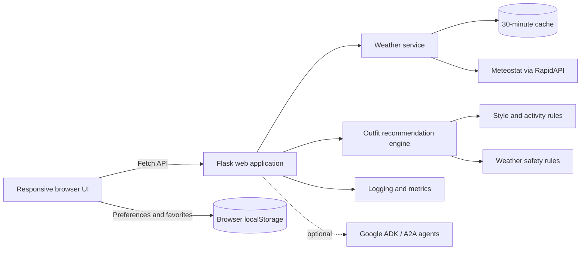

<div align="center">

# 🌦️ Weather Outfit Assistant

### Weather-aware outfit recommendations that combine practical planning, personal style, and safety guidance.

<p>
  
  
  
  
</p>

<p>
  
  
  
  
</p>

**[Overview](#overview) · [Features](#features) · [Architecture](#architecture) · [Quick start](#quick-start) · [API](#api-reference) · [Testing](#testing) · [Roadmap](#roadmap)**

</div>

---

## Overview

Weather Outfit Assistant is a full-stack Flask application that turns city-based weather data into useful outfit guidance. It combines temperature, weather conditions, planned activity, clothing preferences, and color preferences to produce practical recommendations through a responsive dashboard and conversational interface.

The project is designed as a recruiter-friendly engineering case study. It demonstrates API integration, server-side application design, deterministic recommendation logic, responsive frontend development, environment-based secret management, testing, observability, and optional containerized multi-agent deployment.

> [!NOTE]
> The application works without a private API key by returning clearly labeled demo weather data. Add a RapidAPI key locally to test with provider-backed weather data.

## What this project demonstrates

| Engineering area | Implementation |
|---|---|
| **Full-stack development** | Flask API, Python services, JavaScript client, responsive Tailwind CSS interface |
| **External API integration** | Meteostat weather data through RapidAPI with environment-based credentials |
| **Recommendation systems** | Deterministic outfit logic based on temperature, conditions, activity, style, and color preferences |
| **State and personalization** | Browser-side preferences and favorite cities persisted with `localStorage` |
| **Reliability** | Weather response caching, demo-data fallback, health checks, metrics, and error handling |
| **Software architecture** | Shared domain package, separated web app, tests, deployment assets, schemas, tools, and monitoring |
| **Deployment knowledge** | Gunicorn, Docker Compose, Kubernetes manifests, and optional Google ADK/A2A services |
| **Secure configuration** | Private values stored outside source control with `.env` and deployment secrets |

## Features

- Search weather context by city.
- Generate weather-aware outfit combinations.
- Adapt recommendations for heat, cold, rain, snow, wind, and mild conditions.
- Personalize recommendations by style, clothing type, and color palette.
- Adjust outfits for activities such as formal events, hiking, travel, sports, beach trips, and commuting.
- Display weather safety guidance for extreme heat and cold.
- Save favorite cities and preferences in the browser.
- Use conversational prompts and quick actions for outfit guidance.
- Cache weather responses for 30 minutes to reduce repeat API requests.
- Expose health and application metrics endpoints.
- Run an optional multi-service Google ADK/A2A architecture from `deployment/a2a/`.

## Architecture



### Primary request flow

1. The browser requests weather for a selected city.
2. Flask retrieves cached or provider-backed weather data.
3. The client passes weather context and user preferences to the outfit endpoint.
4. The recommendation engine selects weather-appropriate clothing and accessories.
5. The interface renders the result and stores user preferences locally.

## Technology stack

| Layer | Technologies |
|---|---|
| **Frontend** | HTML5, Tailwind CSS, JavaScript ES6+, Fetch API, Material Symbols |
| **Backend** | Python, Flask, Flask-CORS, Gunicorn |
| **Data validation** | Pydantic schemas |
| **Weather provider** | Meteostat through RapidAPI |
| **Persistence** | Browser `localStorage`; in-memory weather cache |
| **Testing** | Python `unittest`, deterministic recommendation tests |
| **Observability** | Structured logging, counters, timing metrics, health endpoint |
| **Optional agent layer** | Google Agent Development Kit, A2A services, Uvicorn |
| **Deployment assets** | Docker, Docker Compose, Kubernetes |

## Project structure

```text
Weather-Outfit-Assistant-Clean/
├── app/
│   ├── __init__.py
│   ├── server.py                 # Flask routes and web server
│   ├── outfit_generator.py       # Presentation-oriented outfit generation
│   ├── static/
│   │   └── app.js                # Browser state, API calls, and rendering
│   └── templates/
│       └── index.html            # Responsive application interface
│
├── weather_outfit_adk/
│   ├── agents/                   # Optional specialist agent definitions
│   ├── config/                   # Environment-backed settings
│   ├── memory/                   # User-memory abstractions
│   ├── monitoring/               # Logging, tracing, dashboards, and metrics
│   ├── schemas/                  # Weather, outfit, and memory models
│   └── tools/                    # Weather, outfit, activity, and safety tools
│
├── deployment/a2a/               # Optional multi-service deployment
├── docs/                         # Architecture, deployment, and code review notes
├── tests/                        # Deterministic and optional ADK checks
├── .env.example                  # Safe environment-variable template
├── .gitignore                    # Excludes secrets and generated files
├── requirements.txt              # Core web dependencies
├── requirements-adk.txt          # Optional agent dependencies
└── run.py                        # Local application entry point
```

## Quick start

### Prerequisites

- Python 3.10 or newer
- Git
- A modern browser
- Optional: RapidAPI account and Meteostat API access for provider-backed weather data

### 1. Clone and enter the repository

```bash
git clone <your-repository-url>
cd <repository-folder>
```

### 2. Create a virtual environment

#### Windows PowerShell

```powershell
python -m venv .venv
Set-ExecutionPolicy -Scope Process -ExecutionPolicy Bypass
.\.venv\Scripts\Activate.ps1
```

The execution-policy change applies only to the current PowerShell session.

#### macOS or Linux

```bash
python3 -m venv .venv
source .venv/bin/activate
```

### 3. Install dependencies

```bash
python -m pip install --upgrade pip
python -m pip install -r requirements.txt
```

### 4. Create the local environment file

#### Windows PowerShell

```powershell
Copy-Item .env.example .env
```

#### macOS or Linux

```bash
cp .env.example .env
```

The safe template remains:

```env
RAPIDAPI_KEY=your_rapidapi_key_here

GOOGLE_CLOUD_PROJECT=your_project_id
GOOGLE_CLOUD_LOCATION=us-central1
COACH_AGENT_URL=http://localhost:8000
```

For provider-backed weather data, replace only the value in your private `.env` file:

```env
RAPIDAPI_KEY=PASTE_YOUR_PRIVATE_KEY_HERE
```

### 5. Confirm the key will not be committed

```bash
git check-ignore .env
```

The command should print:

```text
.env
```

### 6. Start the application

```bash
python run.py
```

Open:

```text
http://localhost:5000
```

## API key and secret management

The real RapidAPI key must never be committed to the repository.

| Environment | Secure location |
|---|---|
| **Local development** | Private `.env` file ignored by Git |
| **GitHub Actions** | Repository secret named `RAPIDAPI_KEY` |
| **Cloud deployment** | Hosting provider environment variable or secret manager |
| **Public repository** | `.env.example` containing placeholders only |

### GitHub repository secret

To make the key available to a GitHub Actions workflow:

1. Open the repository on GitHub.
2. Go to **Settings → Secrets and variables → Actions**.
3. Select **New repository secret**.
4. Use the name `RAPIDAPI_KEY`.
5. Paste the private key as the secret value.

A GitHub secret is available to workflows and deployments that explicitly reference it. It does not automatically copy the key to your local computer.

> [!IMPORTANT]
> If a real key is ever committed, rotate it through RapidAPI. Deleting it from the latest file does not remove it from Git history.

## API reference

### Get weather data

```http
GET /api/weather?city=Charlotte
```

Example response:

```json
{
  "city": "Charlotte",
  "temperature": 84.2,
  "feels_like": 82.2,
  "condition": "partly cloudy",
  "rain_chance": 0.0,
  "wind_speed": 7.5,
  "source": "meteostat"
}
```

When the API key is missing or the provider is unavailable, the response contains a `note` explaining that demo data is being used.

### Generate an outfit

```http
GET /api/outfit?city=Charlotte&temperature=84&condition=sunny&style=Casual&types=Jackets,Jeans,Sneakers&colors=Neutral,Blues
```

The endpoint accepts:

| Parameter | Purpose | Example |
|---|---|---|
| `city` | Display and context city | `Charlotte` |
| `temperature` | Temperature in Fahrenheit | `84` |
| `condition` | Weather description | `sunny` |
| `style` | Comma-separated style preferences | `Casual,Minimalist` |
| `types` | Preferred clothing categories | `Jackets,Jeans,Sneakers` |
| `colors` | Preferred color palettes | `Neutral,Blues` |
| `activity` | Optional activity context | `hiking` |

### Conversational guidance

```http
POST /api/chat
Content-Type: application/json
```

```json
{
  "message": "What should I wear for a long walk?",
  "city": "Charlotte",
  "preferences": {
    "style": ["Casual"],
    "colorPalette": ["Neutral"]
  },
  "session_id": "demo-session",
  "user_id": "demo-user"
}
```

The Flask application contains a local rule-based conversation layer. The Google ADK Coach Agent transport is an optional integration path and is not required for weather and outfit generation.

### Health check

```http
GET /health
```

```json
{
  "status": "healthy",
  "service": "web"
}
```

### Metrics

```http
GET /api/metrics
```

Returns the current application counters and timing statistics.

## Testing

Run the deterministic recommendation tests:

```bash
python -m unittest tests.test_tools -v
```

The suite currently verifies examples such as:

- Hiking is classified as a high-movement sports activity.
- Cold weather adds winter outerwear and accessories.
- Extreme heat produces a high-risk safety classification.

### Optional Google ADK checks

Install the optional dependencies:

```bash
python -m pip install -r requirements-adk.txt
```

Then run:

```bash
python tests/test_adk_imports.py
```

## Deployment

### Local production-style server

```bash
gunicorn --bind 0.0.0.0:${PORT:-5000} app:app
```

On Windows, Gunicorn is generally used in Linux-based hosting or containers. Use `python run.py` for normal local Windows testing.

### Optional Docker and A2A deployment

The `deployment/a2a/` directory contains:

- A shared Dockerfile
- Docker Compose configuration
- Specialist weather, stylist, activity, safety, and coach services
- Kubernetes manifests
- Start, stop, and integration-test scripts

See [`deployment/a2a/README.md`](deployment/a2a/README.md) and [`docs/DEPLOYMENT.md`](docs/DEPLOYMENT.md) for deployment details.

> [!NOTE]
> GitHub Pages cannot run the Flask/Python backend. A live version requires a Python-compatible hosting platform, with `RAPIDAPI_KEY` configured as a private environment variable on that platform.

## Engineering decisions

- **Platform-independent repository:** Replit-specific files, workspace metadata, and runtime assumptions were removed.
- **Single canonical domain package:** Shared Python logic lives only in `weather_outfit_adk/` rather than being duplicated across deployment folders.
- **Dependency separation:** Core Flask dependencies and optional Google ADK dependencies are maintained separately.
- **Secret isolation:** `.env` and local virtual environments are excluded from source control.
- **API efficiency:** Weather responses are cached for 30 minutes.
- **Graceful demonstration mode:** The interface remains usable without exposing or requiring a private API key.
- **Recruiter-readable structure:** Application, domain, deployment, tests, and documentation have clear responsibilities.

## Current project status

The standard Flask web experience is the primary supported implementation. The optional Google ADK/A2A layer is included as an architectural extension and should be treated as experimental until its transport, configuration, and integration tests are completed end to end.

For a transparent engineering assessment, see [`docs/CODE_REVIEW.md`](docs/CODE_REVIEW.md).

## Roadmap

- [ ] Split Flask routes into blueprints and service modules.
- [ ] Replace the current weather endpoint with a provider endpoint designed for live conditions and forecasts.
- [ ] Add structured validation and standardized API errors.
- [ ] Consolidate the two recommendation implementations into one authoritative engine.
- [ ] Add Flask endpoint tests and mocked provider tests.
- [ ] Split the large browser class into API, state, rendering, preferences, and chat modules.
- [ ] Add production security headers, rate limiting, and configurable CORS.
- [ ] Complete and test the optional Coach Agent connection.
- [ ] Add automated CI checks for tests, formatting, and linting.
- [ ] Add product screenshots and a hosted demo.

## Documentation

- [`docs/ARCHITECTURE.md`](docs/ARCHITECTURE.md) — structure and cleanup decisions
- [`docs/CODE_REVIEW.md`](docs/CODE_REVIEW.md) — prioritized engineering backlog
- [`docs/DEPLOYMENT.md`](docs/DEPLOYMENT.md) — deployment guidance
- [`deployment/a2a/README.md`](deployment/a2a/README.md) — optional multi-agent services

## Author

**Tabitha Khadse**  
Frontend-focused software engineer building practical applications at the intersection of software engineering, workflow automation, AI quality, and data-informed user experiences.

- [Portfolio](https://code.tabitha.dev)
- [GitHub](https://github.com/tabitha-dev)

---

<div align="center">

Built as a full-stack engineering portfolio project with an emphasis on usability, maintainability, and transparent technical decision-making.

</div>
